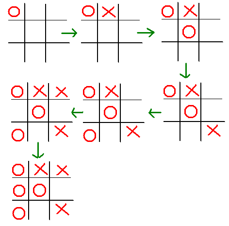
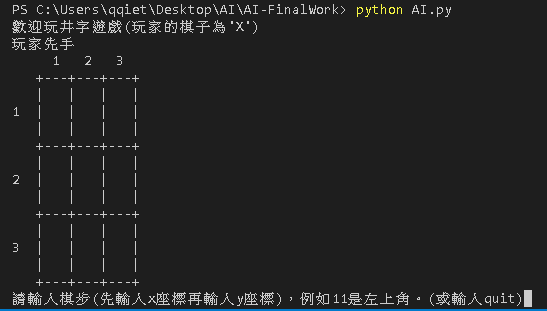
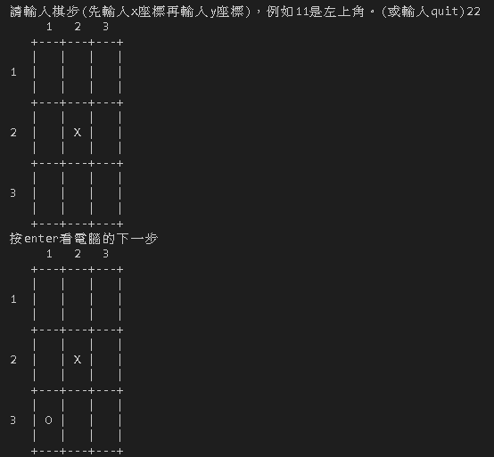
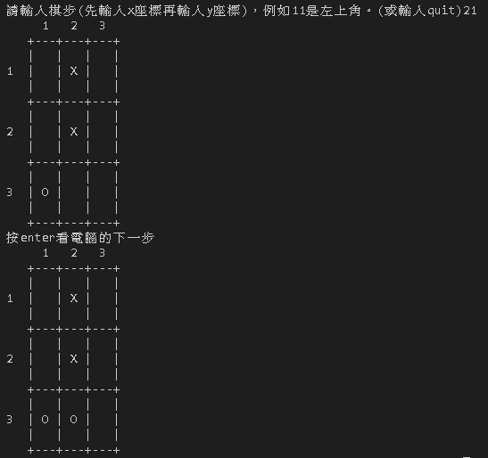
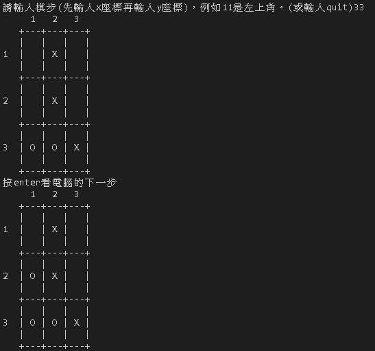
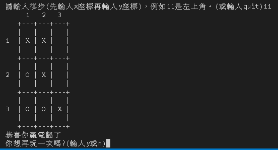

# 人工智慧期末作業
# 井字遊戲
## 聲明
* 部分說明內容擷取自維基百科 
[採用創作共用 CC:BY-SA 授權！](https://zh.wikipedia.org/wiki/Wikipedia:CC_BY-SA_3.0%E5%8D%8F%E8%AE%AE%E6%96%87%E6%9C%AC)
## 參考資料:
* [python人機對戰_【人機對戰】用python打造經典井字遊戲](https://blog.csdn.net/weixin_39990250/article/details/111419831)
* [【Python AI】- AI 下棋訓練](https://www.youtube.com/watch?v=ESyTr-Ol-nY)
* [井字棋](https://zh.wikipedia.org/wiki/%E4%BA%95%E5%AD%97%E6%A3%8B)
## 程式碼:[AI.py](https://github.com/weng0418/AI-FinalWork/blob/main/AI.py)

## 井字遊戲的基本邏輯
* (1)將程式邏輯拆成三個部分:知道一個盤面可以走的棋步有哪些(這個遊戲很單純，空格都可走)
* (2)電腦ai下棋的邏輯
* (3)互動程式的邏輯
 
## 玩法:
* 兩個玩家，一個打圈(◯)，一個打叉（✗），輪流在3乘3的格上打自己的符號，最先以橫、直、斜連成一線則為勝。

* 如果雙方都下得正確無誤，將得和局。

* 這種遊戲實際上是由第一位玩家所控制，第一位玩家是攻，第二位玩家是守。

* 第一位玩家在角位行第一子的話贏面最大，第二位玩家若是在邊，角位下子，第一位玩家就可以以兩粒連線牽制著第二位玩家，然後製造「兩頭蛇」，所以他必須下中央。如第一位玩家下在中央，則第二位玩家必須下在角位才不會輸。如第一位玩家下在邊位，第二位玩家可以下在中央或角位，或是與第一位玩家下的位置相對的邊位。

    

## 實際操作:
    
    
    
    
    
